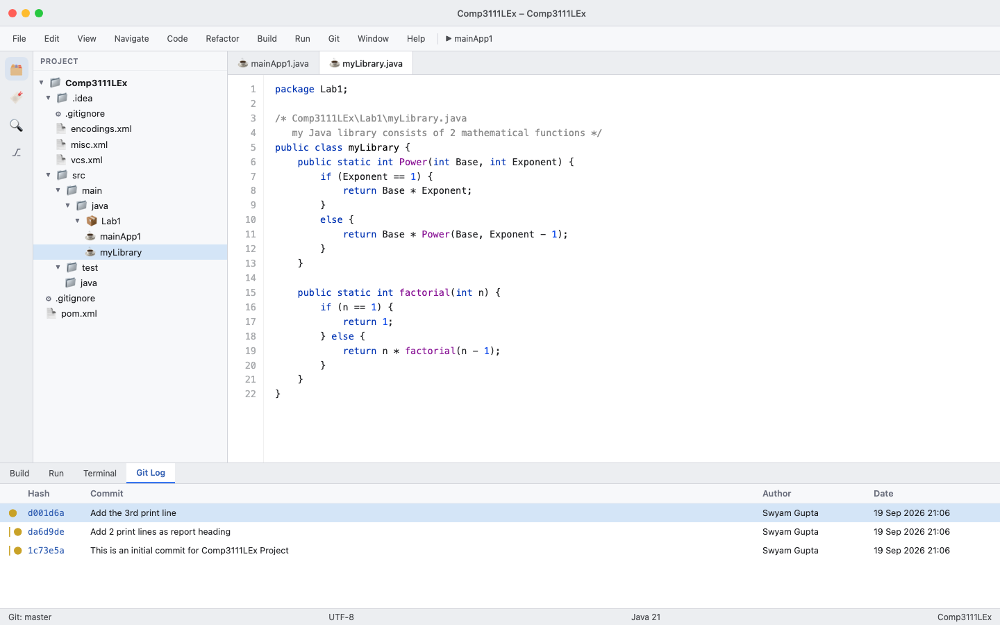

# COMP3111 Lab 1

This is my first lab in COMP3111 Software Engineering.

Remarks:
- Built a Maven Java project named Comp3111LEx
- Added the Lab1 package with `myLibrary` (power and factorial) and `mainApp1`
- Put the project under Git version control and recorded the commit history
- Pushed the project to a public GitHub repository so TAs can check the assignment

Screenshot of the IntelliJ project. It covers:
1. Project tool window with `.idea` and `src` expanded
2. Java class editor for `myLibrary`
3. Git Log tool window with at least three commits

